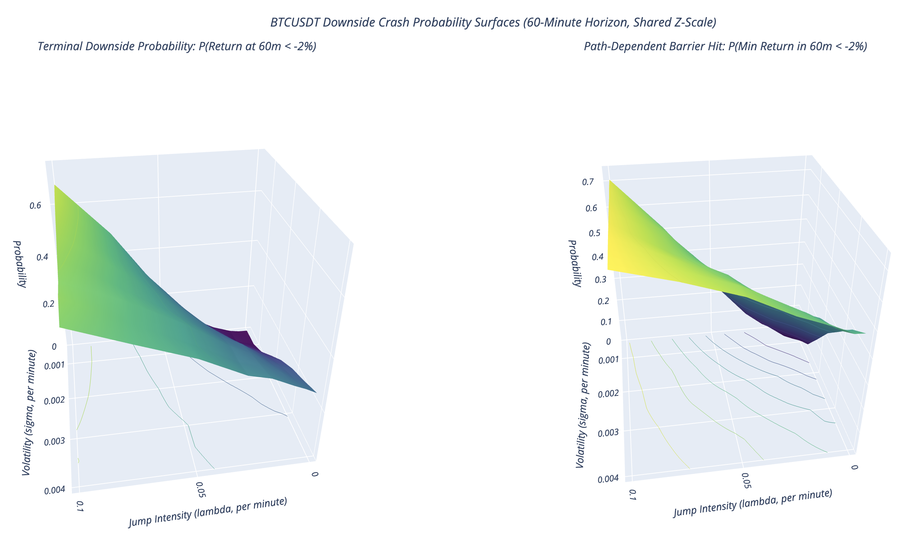

# Crypto Jump Diffusion

This project analyzes short-term BTC/USDT price behavior using a jump-diffusion model under path-independent and path-dependent conditions. It fetches recent 1-minute Binance US data, computes log returns and rolling volatility, detects large downside jumps, estimates jump parameters, and simulates crash probabilities over a short horizon.

Outputs are saved in the `outputs/` folder, including return/volatility plots and an interactive crash probability surface.



## How to Run

```bash
python -m venv .venv
source .venv/bin/activate
pip install -r requirements.txt
python main.py
```

## Configuration

Main settings such as symbol, lookback window, jump threshold, simulation horizon, and number of paths can be changed in `config.py`.

## Project Structure

```text
main.py              # runs the full analysis
config.py            # project settings
src/data_fetch.py    # loads Binance OHLCV data
src/features.py      # computes returns, volatility, and jumps
src/simulation.py    # runs jump-diffusion simulations
data/                # saved datasets
outputs/             # generated charts and HTML files
```
